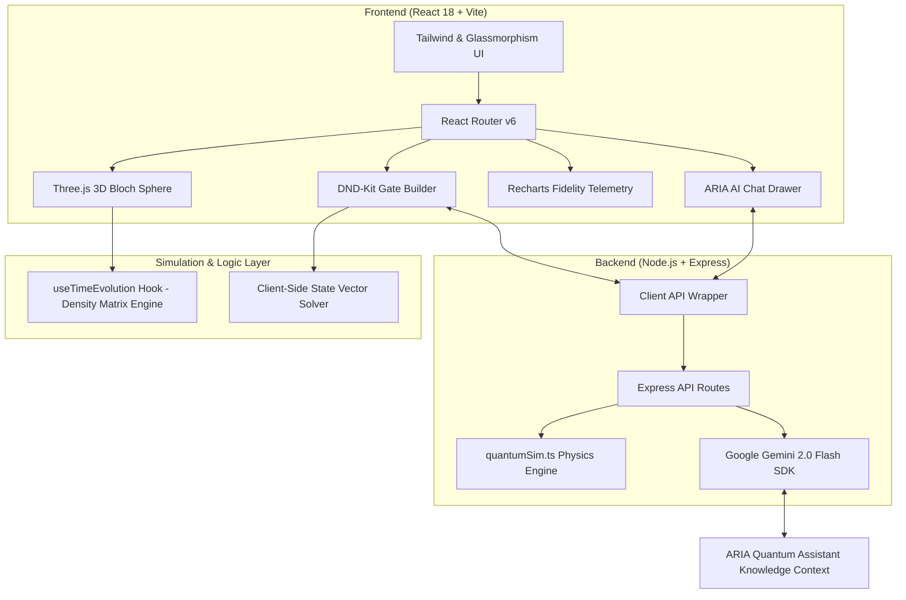

# ⚛️ Quantum Lens Fragility Playground

[](https://react.dev/)
[](https://www.typescriptlang.org/)
[](https://threejs.org/)
[](https://vitejs.dev/)
[](https://tailwindcss.com/)
[](https://expressjs.com/)
[](https://ai.google.dev/)
[](https://quantum-fragility-playground.vercel.app)

> **Quantum Lens Fragility Playground** is an interactive, browser-based virtual quantum mechanics laboratory developed for **HackXAmrita 2.0**. Designed for students, researchers, and quantum enthusiasts, it visualizes the extreme fragility of NISQ-era (Noisy Intermediate-Scale Quantum) qubits, density matrix decoherence, open quantum system noise channels, custom quantum circuit builders, OpenQASM / Qiskit parsers, and interactive quantum algorithm experiments.

🌐 **Live Demo:** [quantum-fragility-playground.vercel.app](https://quantum-fragility-playground.vercel.app)

---

## 📋 Table of Contents

- [💡 Problem Statement & Vision](#-problem-statement--vision)
- [✨ Key Features & Virtual Labs](#-key-features--virtual-labs)
- [🔬 Core Physics & Mathematical Engine](#-core-physics--mathematical-engine)
- [🏗️ System Architecture](#️-system-architecture)
- [🗺️ Route & Page Directory](#️-route--page-directory)
- [📁 Repository Structure](#-repository-structure)
- [🚀 Getting Started & Local Development](#-getting-started--local-development)
- [🔌 API Reference](#-api-reference)
- [🤖 ARIA: AI Quantum Tutor](#-aria-ai-quantum-tutor)
- [🏆 Hackathon Context & Acknowledgements](#-hackathon-context--acknowledgements)
- [📄 License](#-license)

---

## 💡 Problem Statement & Vision

Real-world quantum computers are hindered by **decoherence** — the destructive interaction between delicate quantum superposition/entanglement states and environmental thermal noise. In physical hardware, qubits lose their quantum information within microseconds. 

Most educational resources present quantum noise as dry, abstract differential equations. **Quantum Fragility Playground** bridges the gap between complex quantum information theory and intuitive physical understanding by letting users:
- **Watch qubit decay live** on an interactive 3D Bloch sphere.
- **Manipulate physical noise parameters** ($T_1$ relaxation, $T_2$ dephasing, depolarizing channels) with real-time feedback.
- **Compare classical vs. quantum information degradation** under identical physical environments.
- **Simulate milestone quantum experiments** (Bell state, GHZ state, Deutsch algorithm, BB84 cryptography, Cavity QED).
- **Construct and parse quantum circuits** using drag-and-drop tools and OpenQASM 2.0 / Qiskit formats.

---

## ✨ Key Features & Virtual Labs

### 🌀 1. 3D Bloch Sphere & Fragility Lab (`/fragility-lab`)
- **Real-Time 3D Trajectory**: Built with Three.js, rendering state vector movement and historical decay paths inside the unit sphere.
- **Multi-Channel Noise Sliders**: Adjust Amplitude Damping ($T_1$), Phase Damping ($T_2$), Bit Flip, and Depolarizing noise in real time.
- **Live Fidelity & Decoherence Metrics**: Real-time graphing of state fidelity $F(t)$ and pure state purity $\text{Tr}(\rho^2)$.

### ⚡ 2. Quantum vs. Classical Information Decay (`/quantum-vs-classical`)
- Side-by-side comparison illustrating why classical bits ($0 / 1$) are resistant to environmental noise while quantum superposition states $\alpha\vert 0\rangle + \beta\vert 1\rangle$ rapidly decay without Quantum Error Correction (QEC).

### 🎛️ 3. Drag-and-Drop Gate Builder (`/gate-builder`)
- Interactive circuit workbench using `@dnd-kit`.
- Supports single-qubit gates ($H, X, Y, Z, S, T$) and multi-qubit entangling gates ($CNOT, CZ, SWAP$).
- Computes step-by-step state vector transformations and measurement probability distributions.

### 📜 4. OpenQASM & Qiskit Circuit Visualizers (`/qasm-visualizer` & `/qiskit-visualizer`)
- **OpenQASM 2.0 Parser**: Imports raw quantum assembly code, parses AST tokens, and converts them into visual circuit diagrams.
- **Qiskit JSON Importer**: Renders IBM Qiskit JSON export representations directly into interactive web views.

### 🧪 5. Advanced Quantum Physics Experiments (`/experiments`)
- **Stern-Gerlach Experiment** (`/experiments/stern-gerlach`): Simulates magnetic field gradient angles and spatial spin quantization.
- **Bell State & CHSH Test** (`/experiments/bell-state`): Generates 2-qubit $|\Phi^+\rangle$ entanglement and tests Einstein-Podolsky-Rosen (EPR) correlations & Bell inequality violation.
- **3-Qubit GHZ State** (`/experiments/ghz-state`): Simulates Greenberger-Horne-Zeilinger multi-particle maximal entanglement.
- **Deutsch Algorithm** (`/experiments/deutsch`): Demonstrates quantum parallelism determining whether a black-box oracle function $f(x)$ is constant or balanced in a single evaluation.
- **BB84 QKD Protocol** (`/experiments/bb84`): Simulates Quantum Key Distribution cryptography with optional "Eve" eavesdropper state collapse interception.
- **Cavity QED (Jaynes-Cummings)** (`/experiments/cavity-qed`): Models atom-photon quantum interactions inside optical resonators.

---

## 🔬 Core Physics & Mathematical Engine

Unlike simple predefined animations, the playground's simulation engine calculates open quantum system kinetics using density matrices ($\rho$):

### Density Matrix Evolution
For an initial pure state $\vert\psi\rangle$, the density matrix $\rho(0) = \vert\psi\rangle\langle\psi\vert$ evolves under Kraus operators $\{E_k\}$:
$$\rho(t) = \sum_{k} E_k \rho(0) E_k^\dagger$$

### Noise Channels Modeled
1. **Amplitude Damping ($T_1$ Relaxation):**
   $$E_0 = \begin{pmatrix} 1 & 0 \\ 0 & \sqrt{1-\gamma} \end{pmatrix}, \quad E_1 = \begin{pmatrix} 0 & \sqrt{\gamma} \\ 0 & 0 \end{pmatrix}$$
2. **Phase Damping ($T_2$ Dephasing):**
   $$E_0 = \begin{pmatrix} 1 & 0 \\ 0 & \sqrt{1-\lambda} \end{pmatrix}, \quad E_1 = \begin{pmatrix} 0 & 0 \\ 0 & \sqrt{\lambda} \end{pmatrix}$$
3. **Depolarizing Noise Channel:**
   $$\mathcal{E}(\rho) = (1-p)\rho + \frac{p}{3}(X\rho X + Y\rho Y + Z\rho Z)$$

### State Fidelity
Real-time quantum fidelity is computed as:
$$F = \sqrt{\langle \psi_{\text{ideal}} \vert \rho(t) \vert \psi_{\text{ideal}} \rangle}$$

---

## 🏗️ System Architecture



---

## 🗺️ Route & Page Directory

| Route | Page Component | Description |
| :--- | :--- | :--- |
| `/` | `Home.tsx` | Landing page, project vision, feature highlights, and lab portal. |
| `/fragility-lab` | `FragilityLab.tsx` | Main lab featuring 3D Bloch sphere, density matrix noise sliders, and fidelity graphs. |
| `/quantum-vs-classical` | `QuantumVsClassical.tsx` | Side-by-side comparison of classical bit durability vs qubit decoherence. |
| `/gate-builder` | `GateBuilder.tsx` | Drag-and-drop quantum circuit designer with live measurement probability outputs. |
| `/qiskit-visualizer` | `QiskitVisualizer.tsx` | JSON Qiskit quantum circuit layout parser and visualizer. |
| `/qasm-visualizer` | `QasmVisualizer.tsx` | OpenQASM 2.0 text code parser and interactive circuit diagram engine. |
| `/experiments` | `Experiments/Index.tsx` | Directory of advanced virtual quantum physics experiments. |
| `/experiments/stern-gerlach`| `SternGerlach.tsx` | Stern-Gerlach spin quantization & magnetic field angle simulation. |
| `/experiments/bell-state` | `BellState.tsx` | Bell state $|\Phi^+\rangle$ entanglement generator & CHSH inequality test. |
| `/experiments/ghz-state` | `BellState.tsx` | 3-qubit GHZ state entanglement measurement. |
| `/experiments/deutsch` | `Index.tsx` | Deutsch algorithm demonstration of 1-query quantum function evaluation. |
| `/experiments/bb84` | `Index.tsx` | BB84 Quantum Key Distribution cryptography protocol with Eve eavesdropping. |
| `/experiments/cavity-qed` | `CavityQed.tsx` | Cavity Quantum Electrodynamics (Jaynes-Cummings light-matter coupling). |
| `/learn` | `Learn.tsx` | Interactive quantum mechanics learning modules, theory guides, and quizzes. |
| `/learning-by-simulation` | `LearningBySimulation.tsx` | Step-by-step guided simulations with interactive visual aids. |
| `/about` | `About.tsx` | Project story, HackXAmrita hackathon background, and developer info. |

---

## 📁 Repository Structure

```
quantum-fragility-playground/
├── server/                     # Express Backend Server
│   ├── index.ts                # Express app entry, API routes & Gemini AI chat handler
│   └── quantumSim.ts           # Pure TypeScript quantum physics simulation math
├── src/                        # React Frontend SPA
│   ├── api/                    # Client-side API fetch handlers
│   ├── components/             # Reusable UI & Visualization components
│   │   ├── BlochSphere.tsx     # Three.js 2D/3D Bloch sphere rendering component
│   │   ├── BlochSphere3D.tsx   # Canvas WebGL scene controller
│   │   ├── CircuitDiagram.tsx  # Quantum circuit canvas layout
│   │   ├── DecoherenceGraph.tsx# Recharts time-series fidelity telemetry graph
│   │   ├── QuantumAssistant.tsx# ARIA AI Chatbot floating interface
│   │   ├── TimeMachine.tsx     # Time evolution playback scrubber controls
│   │   └── learning/           # Guided learning visual helpers
│   ├── hooks/                  # Custom React hooks
│   │   ├── useBlochState.ts    # Spherical coordinate vector state math
│   │   ├── useTimeEvolution.ts # Core density matrix & Kraus noise evolution engine
│   │   └── useSound.ts         # Audio feedback effects
│   ├── providers/              # Theme & Guided Tour context providers
│   ├── routes/                 # Page view views & virtual lab components
│   └── types/                  # TypeScript interface definitions (quantum.ts)
├── .env.example                # Template for environment configuration
├── DEPLOY.md                   # Vercel deployment documentation
├── JUDGE_GUIDE.md              # Technical judge reference guide for HackXAmrita 2.0
├── NOTES.md                    # Developer design notes
├── package.json                # Project dependencies & npm build scripts
├── tailwind.config.cjs         # Tailwind CSS theme extension configuration
├── tsconfig.json               # Frontend TypeScript configuration
└── vite.config.ts              # Vite bundling configuration
```

---

## 🚀 Getting Started & Local Development

### Prerequisites
- **Node.js**: `v18.0.0` or higher
- **npm**: `v9.0.0` or higher

### 1. Clone & Install Dependencies
```bash
git clone https://github.com/NVNAGATHARUN/quantum-fragility-playground.git
cd quantum-fragility-playground

# Install frontend and backend packages
npm install
```

### 2. Configure Environment Variables
Copy `.env.example` to create your local `.env` file:
```bash
cp .env.example .env
```

Edit `.env` and add your **Google Gemini API Key** (required for ARIA AI Quantum Tutor):
```env
GEMINI_API_KEY=your_google_gemini_api_key_here
PORT=4000
```
*(Note: If no key is provided, all quantum labs and physics simulations will operate normally, but the AI chatbot will return a friendly setup reminder).*

### 3. Run Full Application (Frontend + Backend)
Start both the Vite dev server and Express backend concurrently:
```bash
npm run dev:full
```
- **Frontend App**: `http://localhost:5173`
- **Backend API**: `http://localhost:4000`

### 4. Run Servers Separately (Optional)
```bash
# Terminal 1: Backend Express Server
npm run server

# Terminal 2: Frontend Vite Server
npm run dev
```

---

## 🔌 API Reference

The Node.js/Express backend (`/server/index.ts`) exposes the following endpoints for multi-qubit simulations and AI assistant orchestration:

| Method | Endpoint | Description | Payload Sample |
| :--- | :--- | :--- | :--- |
| `GET` | `/health` | Server health check status. | N/A |
| `POST` | `/api/experiments/bell` | Simulates Bell State $|\Phi^+\rangle$ measurement statistics. | `{ "shots": 1000 }` |
| `POST` | `/api/experiments/ghz` | Simulates 3-Qubit GHZ State measurement distribution. | `{ "shots": 1000 }` |
| `POST` | `/api/experiments/deutsch` | Runs Deutsch algorithm for a given oracle function ID. | `{ "functionId": 2 }` |
| `POST` | `/api/experiments/bb84` | Simulates BB84 protocol key generation with/without Eve. | `{ "rounds": 100, "withEve": true }` |
| `POST` | `/api/chat` | Sends query context to ARIA (Gemini 2.0 Flash AI). | `{ "message": "What is T1 relaxation?", "history": [] }` |

---

## 🤖 ARIA: AI Quantum Tutor

**ARIA** (Automated Research & Instruction Assistant) is an intelligent quantum physics tutor powered by **Google Gemini 2.0 Flash**.

- **Context-Aware Assistance**: ARIA is configured with system prompt knowledge covering the entire virtual laboratory suite.
- **Interactive Explanations**: Ask ARIA to explain complex phenomena (such as *quantum dephasing vs amplitude damping*, *CHSH inequality violation*, or *quantum key distribution*) and get tailored explanations referencing the specific interactive sliders on your active screen.

---

## 🏆 Hackathon Context & Acknowledgements

Built for **HackXAmrita 2.0** under the **Ed-Tech & Interactive Learning Track**.

### Physics & Theoretical References
- **Nielsen, M. A., & Chuang, I. L.** (2010). *Quantum Computation and Quantum Information*. Cambridge University Press. (Primary foundation for density matrix & Kraus operator mathematical physics engines).
- **IBM Qiskit Documentation**: Reference standard for universal quantum gate set definitions and OpenQASM 2.0 specifications.

---

## 📄 License

Distributed under the MIT License. See `LICENSE` for details.

---

<p align="center">
  Crafted with ⚛️ for <b>HackXAmrita 2.0</b> | <b>Quantum Lens Fragility Playground</b>
</p>
