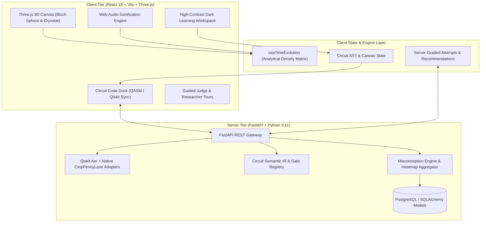

# ⚛️ Quantum Lens AI: Next-Generation Quantum Computing Laboratory & Grounded Pedagogical Platform

<p align="center">
  
  
  
  
  
  
  
  
  
  
</p>

---

## 🏛️ Executive Summary & Problem Statement Alignment

Developed specifically for **Smart India Hackathon (SIH 2026) — Problem Statement 26140 (Smart Education / Quantum Mechanics & Computing Laboratory)**, **Quantum Lens AI** bridges the profound educational chasm between abstract mathematical linear algebra and tangible, noise-dominated physical quantum hardware.

Standard quantum educational tools suffer from three fundamental deficiencies:
1. **The Static Math Trap:** Textbooks present quantum mechanics as static state vectors and closed unitary operators ($U^\dagger U = I$), failing to convey how environmental thermal noise degrades coherence in NISQ-era quantum hardware.
2. **Evidence without ambiguity:** Learners need to distinguish circuit-derived results from simplified educational models instead of seeing unexplained numbers.
3. **Absence of Grounded Pedagogy:** Platforms lack cognitive conflict intervention, student misconception diagnostics, and pedagogical tracking grounded in physics.

**Quantum Lens AI** solves this through a **Three-Lens Grounded Learning Architecture**:
- 📐 **Computation Lens:** Visual circuit synthesis, synchronized OpenQASM 3 editing for the documented supported subset, and Qiskit code export.
- 🧮 **Mathematics Lens:** Exact statevector tracking, density matrix evolution ($\rho$), 3D Bloch sphere vector contraction, and Kraus operator decomposition.
- ❄️ **Hardware / Physics Lens:** Interactive 3D Cryostat (Dilution Refrigerator) thermal stages ($300\text{ K} \to 15\text{ mK}$), transmon QPU coupling, and 60 FPS microwave DRAG pulse synthesis.

---

## 📑 Table of Contents

- [✨ Core Innovations & Virtual Laboratories](#-core-innovations--virtual-laboratories)
- [🔬 Mathematical Physics & Open Quantum Systems Engine](#-mathematical-physics--open-quantum-systems-engine)
- [🏗️ System Architecture](#️-system-architecture)
- [🎛️ Live Virtual Labs & Route Directory](#️-live-virtual-labs--route-directory)
- [🧠 Cognitive Mastery & Instructor Analytics](#-cognitive-mastery--instructor-analytics)
- [🚀 Quickstart & Local Setup](#-quickstart--local-setup)
- [🐳 Production Containerization (Docker)](#-production-containerization-docker)
- [🧪 Automated Test Verification](#-automated-test-verification)
- [📊 Competitive Benchmark Matrix (SIH PS 26140)](#-competitive-benchmark-matrix-sih-ps-26140)
- [📄 License & Acknowledgements](#-license--acknowledgements)

---

## ✨ Core Innovations & Virtual Laboratories

### 1. 🌀 3D Fragility Lab & Real-Time Open Quantum System Engine (`/labs/fragility`)
- **Interactive Three.js 3D Bloch Sphere:** Real-time visual tracking of pure state rotations and mixed state vector length contraction ($|r| \le 1$).
- **Continuous Noise Sliders:** Full dynamic control over:
  - **Amplitude Damping ($T_1$ Relaxation):** Spontaneous energy loss to the thermal bath.
  - **Phase Flip / Dephasing ($T_2$):** Information loss without energy dissipation.
  - **Bit Flip & Isotropic Depolarizing:** Pauli channel contraction toward maximally mixed density matrix $\rho = I/2$.
- **Real-Time Physical Metrics:** Continuous monitoring of Transverse Coherence ($\sqrt{x^2+y^2}$), Purity ($\text{Tr}(\rho^2)$), Vector Length ($|r|$), and **Lindblad Bound Compliance ($T_2 \le 2T_1$)**.
- **🎵 State Sonification Engine:** Synthesizes real-time Web Audio tones that reflect quantum state health; audio frequencies distort audibly as entropy and decoherence increase.
- **Evolution Time Machine:** Scrubber with frame-by-frame history playback to rewind, inspect, and snapshot historical decay points.

### 2. 🧊 3D Dilution Refrigerator Hardware Explorer (`/explore/hardware`)
- **Interactive Cryostat Thermal Stages:** 3D model visualizing physical thermal attenuation stages:
  $$\text{Room Temp (300 K)} \longrightarrow \text{50 K Plate} \longrightarrow \text{4 K Still} \longrightarrow \text{Cold Plate (100 mK)} \longrightarrow \text{Mixing Chamber (15 mK)}$$
- **Microwave Pulse Journey:** Animated visualization tracing pulse travel from room-temperature DACs through cryogenic coaxial attenuators down to the superconducting transmon QPU.
- **Real-Time DRAG Microwave Pulse Synthesizer:** Interactive canvas with Gaussian and Derivative Removal by Adiabatic Gate (DRAG) envelope frequency tuning.

### 3. 🎛️ Universal Circuit Studio & Tri-Directional Code Dock (`/labs/studio`)
- **Drag-and-Drop Quantum Workbench:** Flexible circuit canvas supporting universal gate sets:
  - Single-qubit unitaries: $H, X, Y, Z, S, T, R_x(\theta), R_y(\theta), R_z(\theta)$
  - Multi-qubit entangling gates: $\text{CNOT}, \text{CZ}, \text{SWAP}$
  - Non-unitary operations: qubit measurement into an explicit classical bit and reset to $|0\rangle$
- **Code Synchronization:** Visual edits update generated code; valid edits to the supported OpenQASM 3 subset can be applied back to the canvas:
  1. **OpenQASM 3.0** representation.
  2. **IBM Qiskit (Python)** export.
  3. Canonical AST Intermediate Representation (IR).

### 4. 🚀 Comprehensive Quantum Algorithm Suite (`/explore`)
- **Grover's Search Algorithm (`/explore/grover`):** Step-by-step geometric state vector reflection, oracle phase inversion, and amplitude amplification iterations.
- **Variational Quantum Eigensolver - VQE (`/explore/vqe`):** A clearly labelled fitted two-qubit $H_2$ teaching Hamiltonian with Aer Pauli sampling and classical parameter optimization; it is not an ab-initio chemistry result.
- **Quantum Approximate Optimization Algorithm - QAOA (`/explore/qaoa`):** Max-Cut graph bipartition with interactive 2D $(\gamma, \beta)$ energy landscape contour heatmaps.
- **Quantum Fourier Transform - QFT (`/explore/qft`):** Frequency-domain phase rotation decomposition and period finding.
- **Quantum Teleportation (`/explore/teleportation`):** 3-qubit teleportation protocol demonstrating Bell-state measurement and classical feed-forward Pauli correction.
- **Visual QKD Protocol (`/explore/qkd`):** BB84 intercept-resend simulation with eavesdropper (Eve) controls and an explicitly presented 11% teaching threshold.
- **Deutsch-Jozsa Algorithm (`/explore/deutsch-jozsa`):** Phase kickback oracle verification distinguishing constant from balanced functions in a single evaluation.

### 5. 🌙 Consistent Dark Learning Workspace
- Tokenized navy/blue interface shared across lessons, labs, Studio, challenges and analytics.
- Responsive layouts and semantic controls are implemented; a formal WCAG audit remains on the release checklist.

---

## 🔬 Mathematical Physics & Open Quantum Systems Engine

Circuit Studio can execute the supported unitary CircuitIR subset independently through Qiskit Aer, Cirq, or PennyLane and reports the framework that actually ran. Qiskit Aer additionally supports measurement and reset semantics. Analytical noise and network/chemistry teaching models are explicitly labelled with provenance in their results.

For circuits containing measurement or reset, sampled counts execute the complete circuit in Aer. The browser and API pure-state previews stop immediately before the first non-unitary operation, because one statevector cannot represent the resulting mixed ensemble without choosing a measurement branch.

ARIA exposes the circuit, simulator and persisted learner evidence used for each response, links guidance to internal course material, and labels deterministic versus Gemini output. Structured Gemini claims about probabilities, purity and entropy are checked against server-owned simulator values; conflicting claims are rejected in favor of the deterministic grounded tutor. The reproducible offline contract benchmark and its claim boundary are recorded in [`docs/ARIA_EVALUATION.md`](docs/ARIA_EVALUATION.md).

### Density Matrix Dynamics & Kraus Representation
An initial density operator $\rho(0)$ evolves under non-unitary environmental channels via the Kraus representation:
$$\rho(t) = \mathcal{E}(\rho) = \sum_{k} E_k \, \rho(0) \, E_k^\dagger, \quad \text{subject to} \quad \sum_k E_k^\dagger E_k = I$$

### Modeled Physical Noise Channels
1. **Amplitude Damping ($T_1$ Thermal Relaxation):**
   $$E_0 = \begin{pmatrix} 1 & 0 \\ 0 & \sqrt{1 - \gamma} \end{pmatrix}, \quad E_1 = \begin{pmatrix} 0 & \sqrt{\gamma} \\ 0 & 0 \end{pmatrix}, \quad \gamma = 1 - e^{-t / T_1}$$
2. **Phase Damping ($T_2$ Pure Dephasing):**
   $$E_0 = \begin{pmatrix} 1 & 0 \\ 0 & \sqrt{1 - \lambda} \end{pmatrix}, \quad E_1 = \begin{pmatrix} 0 & 0 \\ 0 & \sqrt{\lambda} \end{pmatrix}, \quad \lambda = 1 - e^{-t / T_\phi}$$
3. **Depolarizing Error Channel:**
   $$\mathcal{E}(\rho) = (1 - p)\rho + \frac{p}{3}\left(X\rho X + Y\rho Y + Z\rho Z\right)$$

### Physical Lindblad Relation Enforcement
In any physical quantum system, transverse relaxation ($T_2$) is fundamentally bounded by longitudinal energy relaxation ($T_1$):
$$\frac{1}{T_2} = \frac{1}{2T_1} + \frac{1}{T_\phi} \implies T_2 \le 2T_1$$
The engine continuously verifies compliance, preventing impossible unphysical trajectories.

### Real-Time Diagnostics
- **Purity:** $\mathcal{P} = \text{Tr}(\rho^2) \in [0.5, 1.0]$ ($1.0 = \text{pure}$, $0.5 = \text{maximally mixed}$).
- **Quantum State Fidelity:** $\mathcal{F}(\rho, \sigma) = \left(\text{Tr}\sqrt{\sqrt{\rho}\sigma\sqrt{\rho}}\right)^2$.

---

## 🏗️ System Architecture


```mermaid
flowchart TB
    subgraph Client ["Client Tier (React 18 + Vite + Three.js)"]
        UI["High-Contrast Dark Learning Workspace"]
        Three["Three.js 3D Canvas (Bloch Sphere & Cryostat)"]
        Dock["Circuit Code Dock (QASM / Qiskit Sync)"]
        Audio["Web Audio Sonification Engine"]
        Tour["Guided Judge & Researcher Tours"]
    end

    subgraph State ["Client State & Engine Layer"]
        SimHook["useTimeEvolution (Analytical Density Matrix)"]
        Mastery["Server-Graded Attempts & Recommendations"]
        StudioState["Circuit AST & Canvas State"]
    end

    subgraph Backend ["Server Tier (FastAPI + Python 3.11)"]
        API["FastAPI REST Gateway"]
        QiskitSim["Qiskit Aer + Native Cirq/PennyLane Adapters"]
        IRValidator["Circuit Semantic IR & Gate Registry"]
        Pedagogy["Misconception Engine & Heatmap Aggregator"]
        DB[(PostgreSQL / SQLAlchemy Models)]
    end

    UI --> StudioState
    Three --> SimHook
    Audio --> SimHook
    StudioState --> Dock
    Dock <--> API
    API --> IRValidator
    API --> QiskitSim
    API --> Pedagogy
    Pedagogy --> DB
    Mastery <--> API
```

---

## 🎛️ Live Virtual Labs & Route Directory

| Route | Component | Description & Key Pedagogical Objective |
| :--- | :--- | :--- |
| `/` | `Home.tsx` | Executive portal, capability status, quick start walkthrough, and system architecture. |
| `/judge` | `JudgeDemo.tsx` | Seven-minute PS 26140 evidence path from diagnosis through measured remediation. |
| `/labs/fragility` | `FragilityLab.tsx` | 3D Bloch sphere, density matrix noise sliders, sonification, and Lindblad metrics. |
| `/labs/studio` | `GateBuilder.tsx` | Drag-and-drop circuit synthesis with bidirectional OpenQASM & Qiskit code docking. |
| `/explore/hardware`| `HardwareExplorer.tsx` | 3D Dilution Refrigerator ($15\text{ mK}$) with real-time DRAG microwave pulse synthesis. |
| `/conflict-labs` | `CognitiveConflictLab.tsx` | Predict-before-observe conflict engine targeting misconceptions M01–M08. |
| `/instructor` | `InstructorDashboard.tsx` | Real-time cohort heatmap, misconception remediation dispatch, and CSV roster export. |
| `/explore/grover` | `Grover.tsx` | Geometric visualization of Grover's amplitude amplification and phase inversion. |
| `/explore/vqe` | `VQE.tsx` | Variational Quantum Eigensolver for $H_2$ molecular ground state energy curve. |
| `/explore/qaoa` | `QAOA.tsx` | Quantum Approximate Optimization Algorithm with 2D Max-Cut energy landscape. |
| `/explore/qft` | `QFT.tsx` | Quantum Fourier Transform phase-kickback and frequency state representations. |
| `/explore/qkd` | `VisualQKD.tsx` | BB84 Quantum Key Distribution with interactive eavesdropping detection. |
| `/explore/teleportation`| `Teleportation.tsx` | Quantum teleportation protocol with Bell measurement and feed-forward corrections. |
| `/explore/deutsch-jozsa`| `DeutschJozsa.tsx` | Oracle evaluation demonstrating exponential query complexity separation. |
| `/learn` | `Learn.tsx` | Modular curriculum with Dirac notation, unitary matrices, and measurement primers. |
| `/student/progress`| `StudentProgress.tsx`| Learner mastery profile, Bayesian knowledge tracing status, and review queue. |

---

## 🧠 Cognitive Mastery & Instructor Analytics

Quantum Lens AI includes a BKT research module, while the learner-facing authoritative mastery score is deliberately simpler and auditable: it is recomputed from persisted, server-graded guided checkpoints and challenges.

### 1. The 8 Canonical Misconceptions (M01–M08)
- **M01: Superposition as Classical Ignorance** (Assuming qubit is simply in state 0 or 1 with unknown probability).
- **M02: Measurement as Passive Observation** (Believing quantum measurement does not perturb the state).
- **M03: Quantum Computing as Parallel Universe Search** (Confusing superposition with brute-force parallel evaluation).
- **M04: Entanglement as Faster-than-Light Communication** (Violating the No-Communication Theorem).
- **M05: No-Cloning Theorem Violations** (Attempting to copy arbitrary unknown quantum states).
- **M06: Global Phase Observability** (Believing $e^{i\theta}\vert\psi\rangle$ is physically distinguishable from $\vert\psi\rangle$).
- **M07: Unitary Reversibility vs. Measurement Collapse** (Confusing gate operations with irreversible projective measurements).
- **M08: Decoherence as Gate Faults** (Confusing coherent unitary errors with non-unitary environmental entangling decay).

### 2. Instructor Heatmap & Remediation Dispatch
Instructors receive a color-coded cohort misconception view derived from persisted evidence. They can inspect remediation context and assign lessons, guided checkpoints, or challenges with due dates; completion is inferred from each learner's server record.

---

## 🚀 Quickstart & Local Setup

### Prerequisites
- **Node.js**: `v18.0.0` or higher
- **Python**: `v3.10` or `v3.11`
- **Git**

### 1. Clone the Repository
```bash
git clone https://github.com/NVNAGATHARUN/gst-qlp.git
cd gst-qlp
```

### 2. Frontend Installation & Build
```bash
# Install frontend dependencies
npm install

# Verify production bundle compilation
npm run build
```

### 3. Backend Setup (FastAPI + Qiskit Aer)
```bash
# Navigate to backend directory
cd backend

# Create and activate Python virtual environment
python -m venv .venv

# Windows:
.\.venv\Scripts\activate
# Linux/macOS:
source .venv/bin/activate

# Install high-performance quantum simulation dependencies
pip install -r requirements.lock
```

### 4. Run the Full Stack Locally

**Terminal 1 — Backend (FastAPI on Port 8000):**
```bash
# From workspace root
$env:PYTHONPATH="backend"
.\backend\.venv\Scripts\python.exe -m uvicorn backend.app.main:app --host 127.0.0.1 --port 8000 --reload
```

**Terminal 2 — Frontend (Vite on Port 5173):**
```bash
# From workspace root
npm run dev
```

Open your browser at **`http://localhost:5173`** to access the laboratory!  
Access the interactive FastAPI Swagger API documentation at **`http://127.0.0.1:8000/docs`**.

---

## 🐳 Containerized Deployment Baseline

Quantum Lens AI includes local full-stack Docker Compose configuration with persistent SQLite storage and required production secrets:

```bash
# Build and run the entire platform with one command
docker-compose up --build -d
```

- **Frontend Application:** `http://localhost:3000`
- **Backend API & Swagger:** `http://localhost:8000`

---

## 🧪 Automated Test Verification

Public judging deployment: [Quantum Lens AI](https://gst-qlp.vercel.app/) · [SIH evidence walkthrough](https://gst-qlp.vercel.app/judge) · [API documentation](https://gst-qlp-api.onrender.com/docs)

CI installs from clean dependency manifests, runs the backend suite and Circuit Studio regression tests, compiles the production frontend, and executes the signed-in adaptive-learning journey in Chromium. To reproduce those checks locally:

```powershell
backend\.venv\Scripts\python.exe -m pytest backend/tests -v -o pythonpath=backend
npm run test:studio
npm run build
npx playwright install chromium
npm run test:e2e
```

The browser test verifies the evidence loop from a failed phase-interference assessment through remediation, a passing retry, resolved misconception state, personalized Aria guidance, multi-engine Circuit Studio execution, account-backed saving, and measurement-aware OpenQASM import. The exact counts are intentionally not hard-coded here; the latest CI run is the source of truth.

For a repeatable judging account and preloaded misconception evidence, reset the dedicated demo data before a presentation:

```powershell
backend\.venv\Scripts\python.exe backend/scripts/seed_demo.py --reset
```

Use `GET /health/ready` to verify that the database and Qiskit Aer simulator are available before the demo.

---

## 📊 PS 26140 Capability Checklist

The table below records this repository's implemented capabilities. Competitor claims were removed because they require a dated, reproducible external evaluation.

| Feature / Dimension | Status |
| :--- | :---: |
| Kraus density-matrix fragility simulation | Implemented and numerically tested |
| Lindblad constraint guidance | Implemented in the fragility workflow |
| Visual circuit + supported OpenQASM editing | Implemented for the documented gate, measurement and reset subset |
| Qiskit Aer execution | Implemented |
| Independent native Cirq and PennyLane execution | Implemented for the supported unitary CircuitIR subset with phase-sensitive conformance tests |
| Guided labs and phase-sensitive challenges | Server-verified and persisted for signed-in learners |
| AI tutoring | Deterministic grounded fallback plus optional Gemini; response provenance exposed |
| Instructor analytics | Derived from persisted verified attempts and misconception evidence |
| Docker deployment | Local Compose configuration provided; production load testing remains pending |

### Delivery Table (Expected Deliverables)

| PS 26140 deliverable | Repository evidence | Current status |
| :--- | :--- | :---: |
| Structured quantum curriculum | M01–M08 lessons with prediction, misconception, lab and checkpoint blocks | Implemented published path |
| Graphical and code circuit design | Circuit Studio with visual gates, measurement/reset, history, parameter editing and supported OpenQASM import | Implemented subset |
| Multiple simulator backends | User-selectable Qiskit Aer, Cirq and PennyLane execution plus cross-framework parity; qBraid is capability-reported but not installed | Implemented local-framework path |
| State and result visualization | Bloch sphere, amplitudes, probabilities, counts, density/noise views | Implemented |
| AI tutoring | Circuit-aware deterministic tutor plus optional Gemini, per-response provenance, public mode status and a 40-case contract benchmark | Implemented contract; human/expert study pending |
| Assessment and coding challenges | Server-graded guided checkpoints and adversarial phase-sensitive challenges | Implemented core path |
| Progress and personalization | Alternate-form baseline/post diagnostics, M01–M08 evidence, remediation state and reasoned next-activity recommendation | Implemented core path |
| Instructor workflow | Classrooms, roster evidence, measured cohort learning gains and due-date assignments | Implemented core path |
| Real quantum hardware | No production hardware connector is claimed | Future integration |

---

## 📄 License & Acknowledgements

This project is licensed under the **MIT License** — see the `LICENSE` file for details.

### Theoretical & Framework References
- **Nielsen, M. A., & Chuang, I. L.** (2010). *Quantum Computation and Quantum Information*. Cambridge University Press.
- **Qiskit Development Team** (2024). *Qiskit: An Open-Source Framework for Quantum Computing*. IBM.
- **Smart India Hackathon (SIH 2026)** — Ministry of Education's Innovation Cell, Government of India.

<p align="center">
  <b>Built with ⚛️ for Smart India Hackathon 2026 | Problem Statement 26140</b>
</p>
