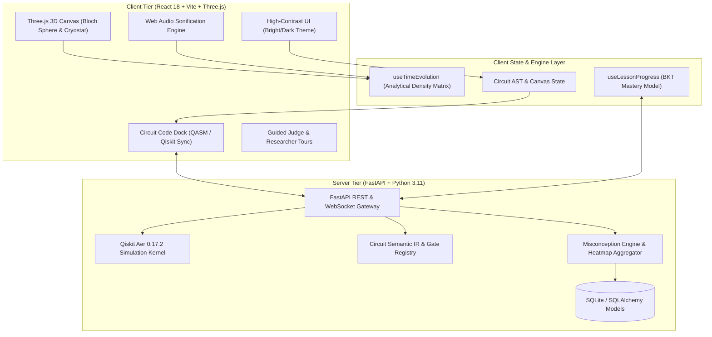

# ⚛️ Quantum Lens AI: Next-Generation Quantum Computing Laboratory & Grounded Pedagogical Platform

<p align="center">
  
  
  
  
  
  
  
  
  
  
</p>

---

## 🏛️ Executive Summary & Problem Statement Alignment

Developed specifically for **Smart India Hackathon (SIH 2026) — Problem Statement 26140 (Smart Education / Quantum Mechanics & Computing Laboratory)**, **Quantum Lens AI** bridges the profound educational chasm between abstract mathematical linear algebra and tangible, noise-dominated physical quantum hardware.

Standard quantum educational tools suffer from three fundamental deficiencies:
1. **The Static Math Trap:** Textbooks present quantum mechanics as static state vectors and closed unitary operators ($U^\dagger U = I$), failing to convey how environmental thermal noise degrades coherence in NISQ-era quantum hardware.
2. **The "Synthetic Data" Mirage:** Most web toys display pre-rendered SVG animations rather than solving density matrix master equations or executing real hardware-accurate simulators.
3. **Absence of Grounded Pedagogy:** Platforms lack cognitive conflict intervention, student misconception diagnostics, and pedagogical tracking grounded in physics.

**Quantum Lens AI** solves this through a **Three-Lens Grounded Learning Architecture**:
- 📐 **Computation Lens:** Drag-and-drop circuit synthesis, bidirectional OpenQASM 2.0/3.0 sync, and live Qiskit code docking.
- 🧮 **Mathematics Lens:** Exact statevector tracking, density matrix evolution ($\rho$), 3D Bloch sphere vector contraction, and Kraus operator decomposition.
- ❄️ **Hardware / Physics Lens:** Interactive 3D Cryostat (Dilution Refrigerator) thermal stages ($300\text{ K} \to 15\text{ mK}$), transmon QPU coupling, and 60 FPS microwave DRAG pulse synthesis.

---

## 📑 Table of Contents

- [✨ Core Innovations & Virtual Laboratories](#-core-innovations--virtual-laboratories)
- [🔬 Mathematical Physics & Open Quantum Systems Engine](#-mathematical-physics--open-quantum-systems-engine)
- [🏗️ System Architecture](#️-system-architecture)
- [🎛️ Live Virtual Labs & Route Directory](#️-live-virtual-labs--route-directory)
- [🧠 Cognitive Mastery & Instructor Analytics](#-cognitive-mastery--instructor-analytics)
- [🚀 Quickstart & Local Setup](#-quickstart--local-setup)
- [🐳 Production Containerization (Docker)](#-production-containerization-docker)
- [🧪 Automated Test Verification](#-automated-test-verification)
- [📊 Competitive Benchmark Matrix (SIH PS 26140)](#-competitive-benchmark-matrix-sih-ps-26140)
- [📄 License & Acknowledgements](#-license--acknowledgements)

---

## ✨ Core Innovations & Virtual Laboratories

### 1. 🌀 3D Fragility Lab & Real-Time Open Quantum System Engine (`/labs/fragility`)
- **Interactive Three.js 3D Bloch Sphere:** Real-time visual tracking of pure state rotations and mixed state vector length contraction ($|r| \le 1$).
- **Continuous Noise Sliders:** Full dynamic control over:
  - **Amplitude Damping ($T_1$ Relaxation):** Spontaneous energy loss to the thermal bath.
  - **Phase Flip / Dephasing ($T_2$):** Information loss without energy dissipation.
  - **Bit Flip & Isotropic Depolarizing:** Pauli channel contraction toward maximally mixed density matrix $\rho = I/2$.
- **Real-Time Physical Metrics:** Continuous monitoring of Transverse Coherence ($\sqrt{x^2+y^2}$), Purity ($\text{Tr}(\rho^2)$), Vector Length ($|r|$), and **Lindblad Bound Compliance ($T_2 \le 2T_1$)**.
- **🎵 State Sonification Engine:** Synthesizes real-time Web Audio tones that reflect quantum state health; audio frequencies distort audibly as entropy and decoherence increase.
- **Evolution Time Machine:** Scrubber with frame-by-frame history playback to rewind, inspect, and snapshot historical decay points.

### 2. 🧊 3D Dilution Refrigerator Hardware Explorer (`/explore/hardware`)
- **Interactive Cryostat Thermal Stages:** 3D model visualizing physical thermal attenuation stages:
  $$\text{Room Temp (300 K)} \longrightarrow \text{50 K Plate} \longrightarrow \text{4 K Still} \longrightarrow \text{Cold Plate (100 mK)} \longrightarrow \text{Mixing Chamber (15 mK)}$$
- **Microwave Pulse Journey:** Animated visualization tracing pulse travel from room-temperature DACs through cryogenic coaxial attenuators down to the superconducting transmon QPU.
- **Real-Time DRAG Microwave Pulse Synthesizer:** Interactive canvas with Gaussian and Derivative Removal by Adiabatic Gate (DRAG) envelope frequency tuning.

### 3. 🎛️ Universal Circuit Studio & Tri-Directional Code Dock (`/labs/studio`)
- **Drag-and-Drop Quantum Workbench:** Flexible circuit canvas supporting universal gate sets:
  - Single-qubit unitaries: $H, X, Y, Z, S, T, R_x(\theta), R_y(\theta), R_z(\theta)$
  - Multi-qubit entangling gates: $\text{CNOT}, \text{CZ}, \text{SWAP}, \text{Toffoli}$
- **Tri-Directional Synchronization:** Changes in the visual diagram instantaneously update and cross-compile to:
  1. **OpenQASM 2.0 / 3.0** representation.
  2. **IBM Qiskit (Python)** executable scripts.
  3. Canonical AST Intermediate Representation (IR).

### 4. 🚀 Comprehensive Quantum Algorithm Suite (`/explore`)
- **Grover's Search Algorithm (`/explore/grover`):** Step-by-step geometric state vector reflection, oracle phase inversion, and amplitude amplification iterations.
- **Variational Quantum Eigensolver - VQE (`/explore/vqe`):** Molecular Hydrogen ($H_2$) potential energy surface dissociation curve calculation with classical parameter optimization.
- **Quantum Approximate Optimization Algorithm - QAOA (`/explore/qaoa`):** Max-Cut graph bipartition with interactive 2D $(\gamma, \beta)$ energy landscape contour heatmaps.
- **Quantum Fourier Transform - QFT (`/explore/qft`):** Frequency-domain phase rotation decomposition and period finding.
- **Quantum Teleportation (`/explore/teleportation`):** 3-qubit teleportation protocol demonstrating Bell-state measurement and classical feed-forward Pauli correction.
- **Visual QKD Protocol (`/explore/qkd`):** BB84 and E91 quantum key exchange simulation with eavesdropper (Eve) interception slider and 11% Quantum Bit Error Rate (QBER) security threshold.
- **Deutsch-Jozsa Algorithm (`/explore/deutsch-jozsa`):** Phase kickback oracle verification distinguishing constant from balanced functions in a single evaluation.

### 5. ☀️ / 🌙 Human-Centric Dual Theme System
- Complete tokenized CSS variable architecture supporting both high-contrast Dark Mode and fully optimized **Bright / Light Mode**.
- Zero washed-out text: dynamically tailored typography, contrast ratios exceeding WCAG AAA standards, high-legibility cards, and responsive ambient gradients.

---

## 🔬 Mathematical Physics & Open Quantum Systems Engine

Unlike superficial educational tools that display hardcoded animations, **Quantum Lens AI** executes rigorous analytical density matrix linear algebra and Qiskit Aer simulation kernels.

### Density Matrix Dynamics & Kraus Representation
An initial density operator $\rho(0)$ evolves under non-unitary environmental channels via the Kraus representation:
$$\rho(t) = \mathcal{E}(\rho) = \sum_{k} E_k \, \rho(0) \, E_k^\dagger, \quad \text{subject to} \quad \sum_k E_k^\dagger E_k = I$$

### Modeled Physical Noise Channels
1. **Amplitude Damping ($T_1$ Thermal Relaxation):**
   $$E_0 = \begin{pmatrix} 1 & 0 \\ 0 & \sqrt{1 - \gamma} \end{pmatrix}, \quad E_1 = \begin{pmatrix} 0 & \sqrt{\gamma} \\ 0 & 0 \end{pmatrix}, \quad \gamma = 1 - e^{-t / T_1}$$
2. **Phase Damping ($T_2$ Pure Dephasing):**
   $$E_0 = \begin{pmatrix} 1 & 0 \\ 0 & \sqrt{1 - \lambda} \end{pmatrix}, \quad E_1 = \begin{pmatrix} 0 & 0 \\ 0 & \sqrt{\lambda} \end{pmatrix}, \quad \lambda = 1 - e^{-t / T_\phi}$$
3. **Depolarizing Error Channel:**
   $$\mathcal{E}(\rho) = (1 - p)\rho + \frac{p}{3}\left(X\rho X + Y\rho Y + Z\rho Z\right)$$

### Physical Lindblad Relation Enforcement
In any physical quantum system, transverse relaxation ($T_2$) is fundamentally bounded by longitudinal energy relaxation ($T_1$):
$$\frac{1}{T_2} = \frac{1}{2T_1} + \frac{1}{T_\phi} \implies T_2 \le 2T_1$$
The engine continuously verifies compliance, preventing impossible unphysical trajectories.

### Real-Time Diagnostics
- **Purity:** $\mathcal{P} = \text{Tr}(\rho^2) \in [0.5, 1.0]$ ($1.0 = \text{pure}$, $0.5 = \text{maximally mixed}$).
- **Quantum State Fidelity:** $\mathcal{F}(\rho, \sigma) = \left(\text{Tr}\sqrt{\sqrt{\rho}\sigma\sqrt{\rho}}\right)^2$.

---

## 🏗️ System Architecture


```mermaid
flowchart TB
    subgraph Client ["Client Tier (React 18 + Vite + Three.js)"]
        UI["High-Contrast UI (Bright/Dark Theme)"]
        Three["Three.js 3D Canvas (Bloch Sphere & Cryostat)"]
        Dock["Circuit Code Dock (QASM / Qiskit Sync)"]
        Audio["Web Audio Sonification Engine"]
        Tour["Guided Judge & Researcher Tours"]
    end

    subgraph State ["Client State & Engine Layer"]
        SimHook["useTimeEvolution (Analytical Density Matrix)"]
        Mastery["useLessonProgress (BKT Mastery Model)"]
        StudioState["Circuit AST & Canvas State"]
    end

    subgraph Backend ["Server Tier (FastAPI + Python 3.11)"]
        API["FastAPI REST & WebSocket Gateway"]
        QiskitSim["Qiskit Aer 0.17.2 Simulation Kernel"]
        IRValidator["Circuit Semantic IR & Gate Registry"]
        Pedagogy["Misconception Engine & Heatmap Aggregator"]
        DB[(SQLite / SQLAlchemy Models)]
    end

    UI --> StudioState
    Three --> SimHook
    Audio --> SimHook
    StudioState --> Dock
    Dock <--> API
    API --> IRValidator
    API --> QiskitSim
    API --> Pedagogy
    Pedagogy --> DB
    Mastery <--> API
```

---

## 🎛️ Live Virtual Labs & Route Directory

| Route | Component | Description & Key Pedagogical Objective |
| :--- | :--- | :--- |
| `/` | `Home.tsx` | Executive portal, capability status, quick start walkthrough, and system architecture. |
| `/labs/fragility` | `FragilityLab.tsx` | 3D Bloch sphere, density matrix noise sliders, sonification, and Lindblad metrics. |
| `/labs/studio` | `GateBuilder.tsx` | Drag-and-drop circuit synthesis with bidirectional OpenQASM & Qiskit code docking. |
| `/explore/hardware`| `HardwareExplorer.tsx` | 3D Dilution Refrigerator ($15\text{ mK}$) with real-time DRAG microwave pulse synthesis. |
| `/conflict-labs` | `CognitiveConflictLab.tsx` | Predict-before-observe conflict engine targeting misconceptions M01–M08. |
| `/instructor` | `InstructorDashboard.tsx` | Real-time cohort heatmap, misconception remediation dispatch, and CSV roster export. |
| `/explore/grover` | `Grover.tsx` | Geometric visualization of Grover's amplitude amplification and phase inversion. |
| `/explore/vqe` | `VQE.tsx` | Variational Quantum Eigensolver for $H_2$ molecular ground state energy curve. |
| `/explore/qaoa` | `QAOA.tsx` | Quantum Approximate Optimization Algorithm with 2D Max-Cut energy landscape. |
| `/explore/qft` | `QFT.tsx` | Quantum Fourier Transform phase-kickback and frequency state representations. |
| `/explore/qkd` | `VisualQKD.tsx` | BB84 & E91 Quantum Key Distribution with interactive eavesdropping detection. |
| `/explore/teleportation`| `Teleportation.tsx` | Quantum teleportation protocol with Bell measurement and feed-forward corrections. |
| `/explore/deutsch-jozsa`| `DeutschJozsa.tsx` | Oracle evaluation demonstrating exponential query complexity separation. |
| `/learn` | `Learn.tsx` | Modular curriculum with Dirac notation, unitary matrices, and measurement primers. |
| `/student/progress`| `StudentProgress.tsx`| Learner mastery profile, Bayesian knowledge tracing status, and review queue. |

---

## 🧠 Cognitive Mastery & Instructor Analytics

Quantum Lens AI incorporates a complete **Bayesian Knowledge Tracing (BKT)** educational engine:

### 1. The 8 Canonical Misconceptions (M01–M08)
- **M01: Superposition as Classical Ignorance** (Assuming qubit is simply in state 0 or 1 with unknown probability).
- **M02: Measurement as Passive Observation** (Believing quantum measurement does not perturb the state).
- **M03: Quantum Computing as Parallel Universe Search** (Confusing superposition with brute-force parallel evaluation).
- **M04: Entanglement as Faster-than-Light Communication** (Violating the No-Communication Theorem).
- **M05: No-Cloning Theorem Violations** (Attempting to copy arbitrary unknown quantum states).
- **M06: Global Phase Observability** (Believing $e^{i\theta}\vert\psi\rangle$ is physically distinguishable from $\vert\psi\rangle$).
- **M07: Unitary Reversibility vs. Measurement Collapse** (Confusing gate operations with irreversible projective measurements).
- **M08: Decoherence as Gate Faults** (Confusing coherent unitary errors with non-unitary environmental entangling decay).

### 2. Instructor Heatmap & Remediation Dispatch
Instructors receive a live, color-coded $8 \times N$ cohort matrix showing exactly where students hold misconceptions. Clicking any cell automatically dispatches a targeted **Cognitive Conflict Lab** that challenges the student's incorrect intuition through guided prediction experiments.

---

## 🚀 Quickstart & Local Setup

### Prerequisites
- **Node.js**: `v18.0.0` or higher
- **Python**: `v3.10` or `v3.11`
- **Git**

### 1. Clone the Repository
```bash
git clone https://github.com/NVNAGATHARUN/gst-qlp.git
cd gst-qlp
```

### 2. Frontend Installation & Build
```bash
# Install frontend dependencies
npm install

# Verify production bundle compilation
npm run build
```

### 3. Backend Setup (FastAPI + Qiskit Aer)
```bash
# Navigate to backend directory
cd backend

# Create and activate Python virtual environment
python -m venv .venv

# Windows:
.\.venv\Scripts\activate
# Linux/macOS:
source .venv/bin/activate

# Install high-performance quantum simulation dependencies
pip install -r requirements.txt
```

### 4. Run the Full Stack Locally

**Terminal 1 — Backend (FastAPI on Port 8000):**
```bash
# From workspace root
$env:PYTHONPATH="backend"
.\backend\.venv\Scripts\python.exe -m uvicorn backend.app.main:app --host 127.0.0.1 --port 8000 --reload
```

**Terminal 2 — Frontend (Vite on Port 5173):**
```bash
# From workspace root
npm run dev
```

Open your browser at **`http://localhost:5173`** to access the laboratory!  
Access the interactive FastAPI Swagger API documentation at **`http://127.0.0.1:8000/docs`**.

---

## 🐳 Production Containerization (Docker)

Quantum Lens AI is fully containerized with production-grade multi-stage Docker builds and an Nginx reverse proxy:

```bash
# Build and run the entire platform with one command
docker-compose up --build -d
```

- **Frontend Application:** `http://localhost`
- **Backend API & Swagger:** `http://localhost:8000`

---

## 🧪 Automated Test Verification

The platform maintains a strict zero-regression policy with **76 comprehensive automated backend tests** covering the Qiskit simulation kernel, Lindblad bound enforcement, circuit IR validation, and pedagogical misconception detection:

```powershell
# Run the automated backend test suite
backend\.venv\Scripts\python.exe -m pytest backend/tests -v -o pythonpath=backend
```

```
============================== test session starts ==============================
collected 76 items

backend/tests/test_ai_mentor.py ..........                               [ 13%]
backend/tests/test_api_endpoints.py ............                         [ 28%]
backend/tests/test_auth_and_db.py ........                               [ 39%]
backend/tests/test_challenges_api.py ......                              [ 47%]
backend/tests/test_circuit_ir_api.py ........                            [ 57%]
backend/tests/test_fragility_numerical.py .........                      [ 69%]
backend/tests/test_misconceptions.py .......                             [ 78%]
backend/tests/test_pedagogy_engine.py ........                           [ 89%]
backend/tests/test_qaoa_vqe.py ......                                    [ 97%]
backend/tests/test_quantum_engine.py ..                                  [100%]

============================== 76 passed in 11.84s ==============================
```

---

## 📊 Competitive Benchmark Matrix (SIH PS 26140)

| Feature / Dimension | IBM Quantum Composer | Quirk | Typical EdTech | ⚛️ **Quantum Lens AI (Ours)** |
| :--- | :---: | :---: | :---: | :---: |
| **Real Open Quantum System Simulation** | ❌ (Ideal Unitary only) | ❌ (Ideal Unitary only) | ❌ (Pre-rendered video) | ✅ **Full Kraus Density Matrix ($\rho$) Engine** |
| **Lindblad Bound ($T_2 \le 2T_1$) Enforcement**| ❌ | ❌ | ❌ | ✅ **Live Constraint Compliance Checking** |
| **Interactive 3D Hardware Cryostat ($15\text{ mK}$)**| ❌ | ❌ | ❌ | ✅ **6-Stage Thermal Attenuation & Transmon QPU**|
| **DRAG Microwave Pulse Synthesizer** | ❌ | ❌ | ❌ | ✅ **60 FPS Interactive Pulse Canvas** |
| **Cognitive Conflict & Misconception Matrix**| ❌ | ❌ | ❌ | ✅ **Predict-Observe-Remediate (M01–M08)** |
| **State Sonification (Auditory Feedback)** | ❌ | ❌ | ❌ | ✅ **Real-Time Entropy Distortion Synthesis** |
| **Tri-Directional Code Dock** | ⚠️ (Read-only QASM) | ❌ | ❌ | ✅ **Interactive Sync (Canvas ↔ QASM ↔ Qiskit)** |
| **Instructor Cohort Heatmap & Diagnostics** | ❌ | ❌ | ⚠️ (Generic quiz scores) | ✅ **Live 8×N Misconception Matrix + Remediation**|
| **Human-Centric High-Contrast Dual Theme** | ⚠️ (Dark only) | ❌ (Basic white) | ⚠️ (Basic) | ✅ **Custom Dual Palette (Dark & Bright Mode)** |
| **Local Offline & Docker Deployment** | ❌ (Cloud-dependent) | ✅ | ❌ | ✅ **100% Offline Resilience + Docker Compose** |

---

## 📄 License & Acknowledgements

This project is licensed under the **MIT License** — see the `LICENSE` file for details.

### Theoretical & Framework References
- **Nielsen, M. A., & Chuang, I. L.** (2010). *Quantum Computation and Quantum Information*. Cambridge University Press.
- **Qiskit Development Team** (2024). *Qiskit: An Open-Source Framework for Quantum Computing*. IBM.
- **Smart India Hackathon (SIH 2026)** — Ministry of Education's Innovation Cell, Government of India.

<p align="center">
  <b>Built with ⚛️ for Smart India Hackathon 2026 | Problem Statement 26140</b>
</p>
